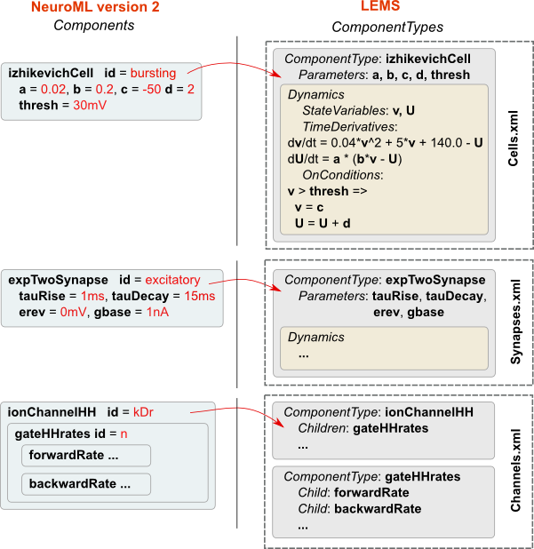

LEMS: the Low Entropy Model Specification Language
---------------------------------------------------

.. rst because Markdown does not do figures with captions, only images.

`LEMS (Low Entropy Model Specification) <http://lems.github.io/LEMS/>`__ is an XML based language with interpreter originally developed by Robert Cannon for specifying generic models of hybrid dynamical systems.
**ComponentType** (**ComponentClass** was briefly used as a name for these) elements which specify **Parameter**\ s, **StateVariable**\ s and their **Dynamics** and **Structure** can be defined as templates for model elements (e.g. HH ion channels, abstract cells, etc.).
**Components** are instances of these with specific values of **Parameters** (e.g. HH squid axon Na+ channel, I&F cell with threshold -60mV, etc.).

For an in-depth guide to LEMS, please see the research paper: `LEMS: a language for expressing complex biological models in concise and hierarchical form and its use in underpinning NeuroML 2 <https://www.frontiersin.org/articles/10.3389/fninf.2014.00079/full>`__

- `jLEMS <https://github.com/LEMS/jLEMS>`__ is a Java package for parsing and executing LEMS models and is the reference implementation of the LEMS language.
- `PyLEMS <https://github.com/LEMS/pylems>`__ is a Python API for reading and writing LEMS and can also execute models in the language.

LEMS and NeuroML2
==================

   This image (adapted from `Vella et al. 2014 <http://journal.frontiersin.org/Journal/10.3389/fninf.2014.00038/abstract>`__) shows the usage of LEMS **ComponentTypes** and **Components** in NeuroML.
   Elements in NeuroML v2 are **Components** which have a corresponding structural and mathematical definition in LEMS **ComponentTypes**.
   A number of examples of **ComponentTypes** in LEMS are shown.
   A **ComponentType** `izhikevichCell <http://www.neuroml.org/NeuroML2CoreTypes/Cells.html#izhikevichCell>`__ is defined in LEMS, and its parameters are specified as **a**, **b**, **c**, **d**, and **thresh**.
   The Dynamics of the **ComponentType** defines the state variables **v** and **U**.
   LEMS specifies how these vary with time.
   Conditions such as when the membrane potential crosses firing threshold are also defined using **OnConditions**.
   Shortened examples of a synapse (`expTwoSynapse <http://www.neuroml.org/NeuroML2CoreTypes/Synapses.html#expTwoSynapse>`__) and an ion channel model (`ionChannelHH <http://www.neuroml.org/NeuroML2CoreTypes/Channels.html#ionChannelHH>`__) are also shown.
   Instances of LEMS **ComponentTypes** can be created by specifying the values for each of the parameters.
   These instances are usually contained in NeuroML XML files.
