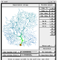
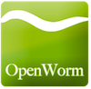
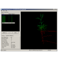
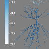

(userdocs:supporting)=
# Tools and resources with NeuroML support

```{admonition} Please help us keep this page up to date.
:class: note

Tools listed here may no longer be maintained, or may have moved to new locations, and others may be missing.
Please [file issues](https://github.com/NeuroML/Documentation/issues/new/choose) if you can help update this information.
```


Apart from the core NeuroML tools ({ref}`pyNeuroML <pyNeuroML>`, {ref}`jNeuroML <jNeuroML>`, etc.) there are many
other applications, libraries and databases which support NeuroML 2 and LEMS.

(userdocs:supporting:apps)=
## Applications with NeuroML support

(userdocs:supporting:apps:netpyne)=
### NetPyNE


[NetPyNE] is a Python package to facilitate the development, simulation, parallelization, analysis, and optimization of biological neuronal networks using the NEURON simulator. NetPyNE can import from and export to NeuroML. NetPyNE also provides a web based [Graphical User Interface](https://github.com/MetaCell/NetPyNE-UI/wiki).

More information on running NeuroML models in NetPyNE can be found {ref}`here <userdocs:simulating_models:netpyne>`.

(userdocs:supporting:apps:neuroconstruct)=
### neuroConstruct


[neuroConstruct] is a Java based application for constructing 3D networks of biologically realistic neurons. The current version can generate code for the [NEURON], [GENESIS], [PSICS] and [PyNN] platforms and also provides import/export support for MorphML, ChannelML and NetworkML (from NeuroML v1) and for NeuroMLv2 cells and networks. More info on the support for NeuroML in neuroConstruct is available [here](http://www.neuroconstruct.org/docs/neuroml.html).


(userdocs:supporting:apps:neuron)=
### NEURON


The [NEURON] simulation environment is one of the main target platforms for a standard facilitating exchange of neuronal models. NEURON simulations can be generated from NeuroML model components by [neuroConstruct].

{ref}`jNeuroML <jneuroml>` can also be used to convert NeuroML2/LEMS models to NEURON. More information on running NeuroML models in NEURON can be found {ref}`here <userdocs:simulating_models:neuron>`.


(userdocs:supporting:apps:genesis)=
### GENESIS



[GENESIS] is a commonly used neuronal simulation environment and was a main target platform for the NeuroMLv1 specifications. Full GENESIS simulations can be generated from NeuroMLv1 model components by [neuroConstruct].

Due to the lack of active development of GENESIS, support for mapping to GENESIS in NeuroMLv2 has been deprecated in favour of {ref}`MOOSE <userdocs:supporting:apps:moose>`.

(userdocs:supporting:apps:moose)=
### MOOSE


[MOOSE] is the Multiscale Object-Oriented Simulation Environment. It is the base and numerical core for large, detailed multi-scale simulations that span computational neuroscience and systems biology. It is based on a complete reimplementation of the GENESIS 2 core, and scripts for that environment are largely compatible with MOOSE.

More information on running NeuroML models in MOOSE can be found {ref}`here <userdocs:simulating_models:moose>`.

(userdocs:supporting:apps:brian)=
### BRIAN


[Brian] is an easy to use, Python based simulator of spiking networks.

More information on running NeuroML models in Brian can be found {ref}`here <userdocs:simulating_models:brian2>`.

(userdocs:supporting:apps:eden)=
### EDEN

[EDEN] is a recently developed simulation engine which incorporates native NeuroML 2 support from the start.

Initial tests of using EDEN with NeuroML models and example code can be found [here](https://github.com/OpenSourceBrain/EDENShowcase).

There is a **dedicated page on EDEN/NeuroML interactions** {ref}`here <userdocs:eden>`.

(userdocs:supporting:apps:arbor)=
### Arbor


[Arbor] is a high performance multicompartmental neural simulation library. Addition of support for NeuroML2 and LEMS is under active development.
See [here](https://docs.arbor-sim.org/en/stable/fileformat/neuroml.html).

Example code for interactions between NeuroML models and Arbor can be found [here](https://github.com/OpenSourceBrain/ArborShowcase).

There is a **dedicated page on Arbor/NeuroML interactions** {ref}`here <userdocs:arbor>`.

(userdocs:supporting:apps:pynn)=
### PyNN


[PyNN] is a Python package for simulator independent specification of neuronal network models. Model code can be developed using the PyNN API and then run using [NEURON], [NEST] or [Brian]. The developed model also can be stored as a NeuroML document. The latest version of [neuroConstruct] can be used to generate executable scripts for PyNN based simulators based on NeuroML components, although the majority of multicompartmental conductance based models which are available in neuroConstruct are outside the current scope of the PyNN API.

More info on the latest support for running NeuroML models in PyNN and vice versa can be found [here](https://github.com/NeuroML/NeuroML2/issues/73).

(userdocs:supporting:apps:openworm)=
### OpenWorm



The [OpenWorm] project aims to create a simulation platform to build digital <i>in-silico</i> living systems, starting with a <i>C. elegans</i> virtual organism simulation. The simulations and associated tools are being developed in a fully open source manner. NeuroML is being used for the description of the 302 neurons in the worm's nervous system, both for morphological description of the cells and their electrical properties.

The [c302 subproject](https://github.com/openworm/c302) in OpenWorm has the latest developments in the NeuroML version of the worm nervous system.

 Members of the OpenWorm project are also creating a general purpose neuronal simulator (for both electrical and physical simulations) which will have parallelism and native support for NeuroML built in from the start (see [Geppetto](#geppetto)).

(userdocs:supporting:apps:lfpy)=
### LFPy


[LFPy] is a Python package for calculation of extracellular potentials from multicompartment neuron models. It relies on the NEURON simulator and uses the Python interface it provides. LFPy provides a set of easy to use Python classes for setting up the model, running simulations and calculating the extracellular potentials arising from activity in the model neuron. Initial support for loading of NeuroML morphologies has been added.


(userdocs:supporting:apps:neuronland)=
### NeuronLand



[NeuronLand] provides NLMorphologyConverter, which is a command line program for converting between over 20 different 3D neuron morphology formats, and NLMorphologyViewer, which provides a simple interface for viewing these data. Both of these tools provide import and export of MorphML.

(userdocs:supporting:apps:cx3d)=
### CX3D


[CX3D] is a tool for simulating the growth of cortex in 3D. There was a preliminary implementation of export of generated networks to NeuroML in CX3D.

(userdocs:supporting:apps:trees)=
### TREES toolbox


The [TREES toolbox] is an application in MATLAB which allows: automatic reconstruction of neuronal branching from microscopy image stacks and generation of synthetic axonal and dendritic trees; visualisation, editing and analysis of neuronal trees; comparison of branching patterns between neurons; and investigation of how dendritic and axonal branching depends on local optimization of total wiring and conduction distance.

The latest version of the TREES toolbox includes basic functionality for exporting cells in NeuroML v1.x Level 1 (MorphML) or as a NeuroML v2alpha morphology file.

(userdocs:supporting:apps:trackem)=
### TrakEM2


[TrakEM2] is an ImageJ plugin for morphological data mining, three-dimensional modelling and image stitching, registration, editing and annotation. As of v0.8n, a menu item "Export - NeuroML..." gives an option to export to MorphML (the anatomy of the arbors only) or NeuroML (the whole network with anatomy and synapses), for the selected trees or all trees.

(userdocs:supporting:apps:neurovisio)=
### Neuronvisio



[Neuronvisio] is a Graphical User Interface for NEURON simulator environment with 3D capabilities. Neuronvisio makes easy to select and investigate sections' properties, it offers easy integration with matplotlib for the plotting the results. It can save the geometry using NeuroML and the simulation results in a customised and extensible HDF5 format; the results can then be reload in the software and analysed at a later stage, without re-running the simulation.


(userdocs:supporting:apps:catmaid)=
### CATMAID


[CATMAID] is the Collaborative Annotation Toolkit for Massive Amounts of Image Data, and is a widely used tool for online reconstruction and annotation of connectomics data. Initial support for export of reconstructed neurons in NeuroML format has been added.

(userdocs:supporting:apps:myokit)=
### Myokit


[Myokit] (the Maastricht Myocyte Toolkit) is a Python-based software package created by Michael Clerx to simplify the use of numerical models in the analysis of cardiac myocytes. Initial support for importing ChannelML [has been added](https://myokit.readthedocs.io/en/stable/api_formats/index.html#api-formats).

(userdocs:supporting:apps:geppetto)=
### Geppetto


[Geppetto] is a web-based multi-algorithm, multi-scale simulation platform designed to support the simulation of complex biological systems and their surrounding environment. It is open source and is being developed as part of the [OpenWorm project](#openworm) to create an _in-silico_ model of the nematode _C. elegans_. It has had inbuilt support for NeuroML 2/LEMS from the start, and is suitable for many other types of neuronal models.

(userdocs:supporting:other)=
## Other/legacy tools

```{admonition} Older applications
Note: many of the applications listed below are no longer in active development or links no longer work.
```

(userdocs:supporting:other:psics)=
### PSICS

The latest version of [neuroConstruct] can be used to generate executable scripts for [PSICS] based on NeuroML components.

(userdocs:supporting:other:wbc)=
### Whole Brain Catalogue

The [Whole Brain Catalog] was a graphical interface that allowed multiscale neuroscience data to be visualised relative to a 3D brain atlas.

(userdocs:supporting:other:pcsim)=
### PCSIM
[PCSIM] is a tool in C++ for simulating large scale networks of cells and synapses.

(userdocs:supporting:other:neuromantic)=
### Neuromantic
[Neuromantic] is a freeware tool for neuronal reconstruction (similar in some ways to part of Neurolucida's functionality).
Neuromantic mainly uses SWC/Cvapp format, but the latest version can import and export MorphML.

(userdocs:supporting:other:neurospaces)=
### Neurospaces/ GENESIS 3
The [Neurospaces/ GENESIS 3] project is developing a modular reimplementation of the core of GENESIS 2 along with a number of other components for computational neuroscience as part of the GENESIS 3 initiative.
Neurospaces/GENESIS 3 currently supports reading of passive models in NeuroML format (morphology + passive parameters).

(userdocs:supporting:other:splitneuron)=
### SplitNeuron
[SplitNeuron] is a library written in C for data structures and functions extending SQLite to simulate large-scale networks of Izhikevich Simple Model compartments.
SplitNeuron answers a fundamental issue in large-scale simulation, data transfer between storage and functional software: it uses database not only for data storage but also as simulation engine, moving computation to data rather than using storage systems only for data holding.
This choice offers more features with less code to write and a unique way of accessing data for further analysis.
Features under development include direct import and cell/network creation from NeuroML.

(userdocs:supporting:other:neuranim)=
### NeurAnim
[NeurAnim] is a research aid for computational neuroscience.
It is used to visualise and animate neural network simulations in 3D, and to render movies of these animations for use in presentations.
Networks stored in the instance based representation of NetworkML can be loaded and visualised.

(userdocs:supporting:other:cnrun)=
### CNrun
[CNrun] is a neuronal network model simulator, similar in purpose to NEURON except that individual neurons are not compartmentalised.
It was built from refactored code written by Thomas Nowotny.
It reads in network topology description from a NeuroML file, where the cell_type attribute determines the unit class, one of the in-built neuron types of CNrun (e.g. Hodgkin Huxley cell by Traub and Miles (1991), Poisson oscillator, van der Pol oscillator).

(userdocs:supporting:other:neugen)=
### NeuGen
[NeuGen] is an application in Java which is able to generate networks of synaptically connected morphologically detailed neurons, as in a cortical column.
NeuGen generates sets of neurons of the different morphological classes of the cortex, e.g. pyramidal cells and stellate neurons, and connects these networks in 3D.
The latest version of NeuGen can export the generated networks to NeuroML.
Some manual editing of the generated files is required to make them valid.
The developers have been informed of the required updates which will be incorporated soon.

(userdocs:supporting:other:morphforge)=
### morphforge
[morphforge] is a high level, simulator independent, Python library for building simulations of small populations of multi-compartmental neurons.
It was built as part of the PhD thesis of Mike Hull (Uni.
Edinburgh): Investigating the role of electrical coupling in small populations of interneurons in Xenopus laevis tadpoles.
Loading of morphologies in MorphML format is supported, and loading of channel descriptions from ChannelML is in progress.
Future development of morphforge will be closely aligned with the development of the multicompartmental modelling API in Python (libNeuroML).

(userdocs:supporting:other:neurotranslate)=
### NeuroTranslate
[NeuroTranslate] is a tool that translates input files between two different languages, the NCS (Neo-Cortical Simulator) input language and NeuroML format.
It provides a user-friendly interface, which can be used to both create and edit simulations.

(userdocs:supporting:other:moogli)=
### Moogli
[Moogli] (a sister project of [MOOSE](#moose)) is a simulator independent OpenGL based visualization tool for neural simulations.
Moogli can visualize morphology of single/multiple neurons or network of neurons, and can also visualize activity in these cells.
Loading of morphologies in MorphML and NeuroML formats is supported.

[neuroConstruct]: http://www.neuroconstruct.org
[NEURON]: http://www.neuron.yale.edu/neuron/
[NetPyNE]: http://netpyne.org/
[GENESIS]: http://genesis-sim.org/
[MOOSE]: https://moose.ncbs.res.in/
[PSICS]: http://www.psics.org/index.html
[PyNN]: http://neuralensemble.org/PyNN/
[NeuronLand]: http://neuronland.org/
[PCSIM]: http://www.lsm.tugraz.at/pcsim/
[CX3D]: http://www.ini.uzh.ch/~amw/seco/cx3d/
[Neuromantic]: https://sourceforge.net/projects/neuromantic/
[Neurospaces/ GENESIS 3]: http://neurospaces.sourceforge.net/
[SplitNeuron]: https://sourceforge.net/projects/splitneuron/
[Whole Brain Catalog]: https://twitter.com/braincatalog
[NeurAnim]: https://sourceforge.net/projects/neuranim/
[CNrun]: http://johnhommer.com/academic/code/cnrun/
[Trees toolbox]: https://github.com/cuntzlab/treestoolbox
[TrakEM2]: http://www.ini.uzh.ch/~acardona/trakem2.html
[Neuronvisio]: http://neuronvisio.org/
[OpenWorm]: http://openworm.org/
[NeuGen]: https://durus.gcsc.uni-frankfurt.de/~neugen/
[LFPy]: https://lfpy.readthedocs.io/en/latest/
[morphforge]: https://github.com/mikehulluk/morphforge
[NeuroTranslate]: https://github.com/nathanjordan/NeuroTranslate
[Moogli]: https://moose.ncbs.res.in/readthedocs/user/py/graphics/index_graphics.html
[CATMAID]: https://catmaid.readthedocs.io/en/stable/
[Myokit]: http://myokit.org/
[Neurovisio]: http://neuronvisio.org/
[Geppetto]: http://www.geppetto.org/
[NEST]: https://nest-simulator.org/
[Brian]: https://briansimulator.org/
[EDEN]: https://gitlab.com/neurocomputing-lab/Inferior_OliveEMC/eden
[Arbor]: https://arbor-sim.org/
