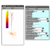

(userdocs:neuron)=
# NEURON and NeuroML



[NEURON](http://www.neuron.yale.edu/neuron) is a widely used simulation environment and is one of the main target platforms for a standard facilitating exchange of neuronal models.

(userdocs:neuron:simulating)=
## Simulating NeuroML models in NEURON

{ref}`jNeuroML <jneuroml>` or {ref}`pyNeuroML <pyNeuroML>` can be used to convert NeuroML2/LEMS models to NEURON. This involves pointing at a {ref}`LEMS Simulation file <userdocs:lemssimulation>` describing what to simulate, and using the `-neuron` option:

```{code-block} console
# Simulate the model using NEURON with python/hoc/mod files generated by jNeuroML
jnml <LEMS simulation file> -neuron -run

# Simulate the model using NEURON with python/hoc/mod files generated by pyNeuroML
pynml <LEMS simulation file> -neuron -run
```

These commands generate a PyNeuron script and run it (a file ending in `_nrn.py`).
So you must have NEURON installed on your system, with its Python bindings (PyNeuron).
Skipping the `-run` flag will generate the Python script but will not run it: you can run it manually later.
Adding `-nogui` will suppress the NEURON graphical elements/menu opening and just run the model in NEURON in the background

You can also run LEMS simulations using the NEURON simulator using the {ref}`pyNeuroML <pyneuroml>` API:

```{code-block} python
from pyneuroml.pynml import run_lems_with_jneuroml_neuron

...

run_lems_with_jneuroml_neuron(lems_file_name)
```

(userdocs:neuron:envvar)=
## Setting the NEURON_HOME environment variable

Since it is possible to install multiple versions of NEURON in different places, the NeuroML tools need to be told where the NEURON tools are.
To do this, they look at the `NEURON_HOME` environment variable.
This needs to hold the path to where the binary (`bin`) folder holding the NEURON tools such as `nrniv` are located.
On Linux like systems, one can use `which` to find these tools and set the variable:

``` {code-block} bash
$ which nrniv
~/.local/share/virtualenvs/neuroml-311-dev/bin/nrniv

$ export NEURON_HOME="~/.local/share/virtualenvs/neuroml-311-dev/"
```

One can combine these commands together also:

``` {code-block} bash
$ export NEURON_HOME="$(dirname $(dirname $(which nrniv)))"
```

(userdocs:neuron:neuroconstruct)=
## Using neuroConstruct

NEURON simulations can also be generated from NeuroML model components by {ref}`neuroConstruct <userdocs:supporting:apps:neuroconstruct>`, but most of this functionality is related to {ref}`NeuroML v1 <userdocs:neuromlv1>`.
