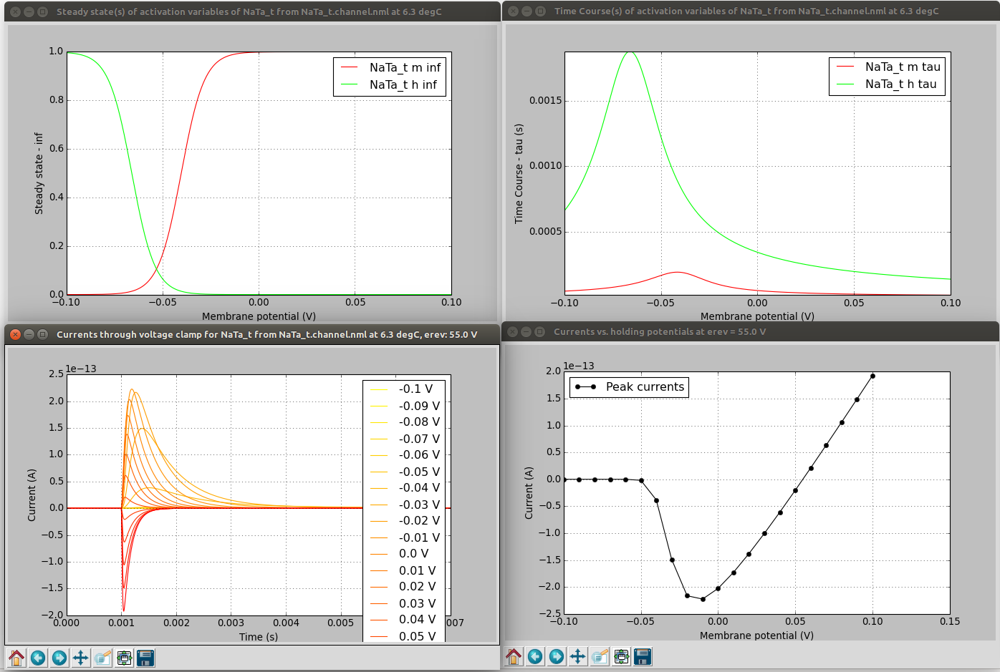
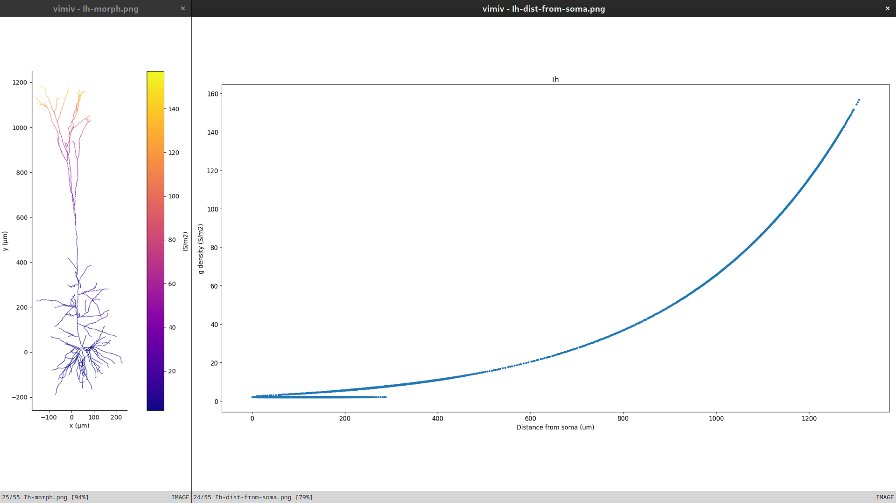
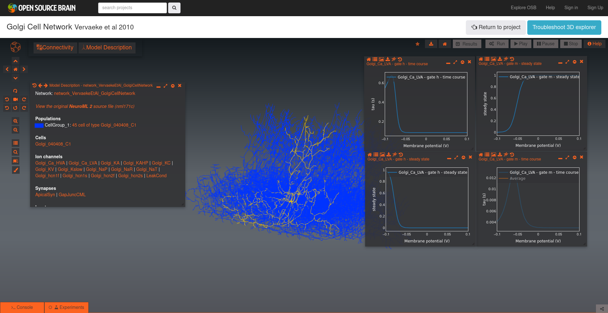
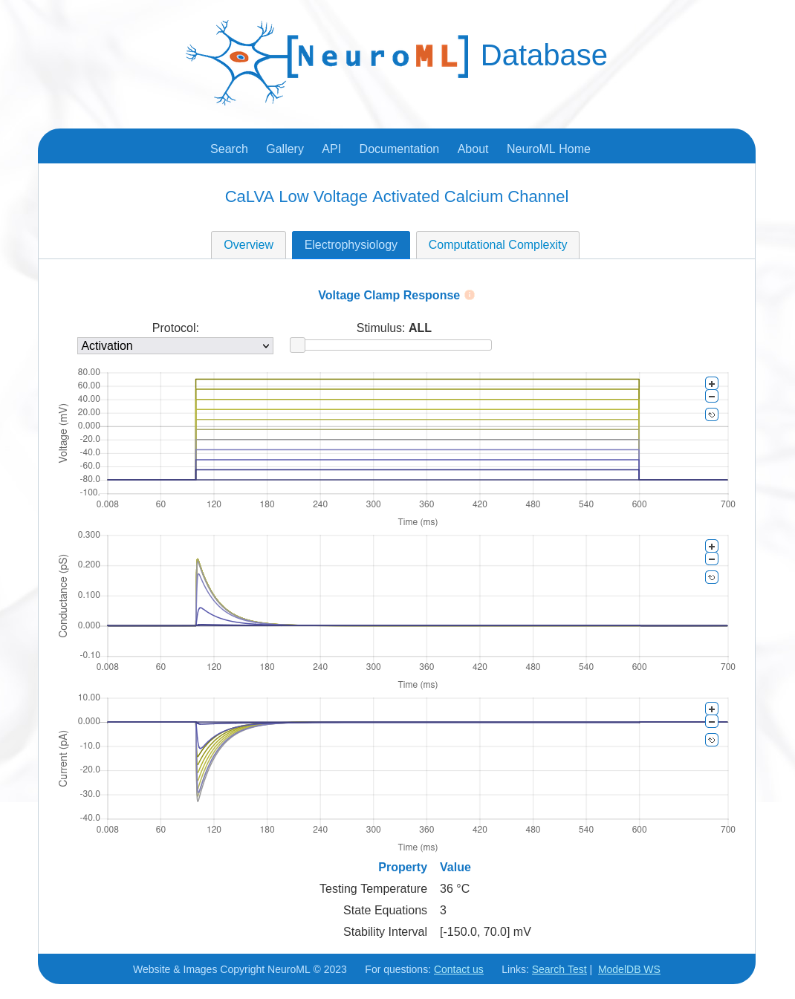

(userdocs:visualising_channels)=
# Visualising and analysing ion channel models

A core part of NeuroML is the ability to specify voltage dependent (and potentially concentration dependent) membrane conductances, which are due to ion channels.


## Help converting/examining channels in NeuroML

Converting your own ion channel models to NeuroML is facilitated by examples (e.g. [a simple HH Na+ channel](https://github.com/NeuroML/NeuroML2/tree/master/examples/NML2_SimpleIonChannel.nml)) and the specification documentation (e.g. for {ref}`<ionChannelHH> <schema:ionChannelHH>`, {ref}`<gateHHrates> <schema:gateHHrates>`, {ref}`<HHExpLinearRate> <schema:HHExpLinearRate>`, but there are also a number of software tools which can be used to view the internal properties of the ion channels, as well as their behaviour.

```{admonition} Converting cell models to NeuroML
:class: tip
Note: there is a full guide to {ref}`Converting cell models to NeuroML and sharing them on Open Source Brain <userdocs:creating_models:converting_conductance>` which uses some of the tools and methods below.
```


### 1) Use jnml -info  (note not in pynml yet...)

{ref}`jNeuroML <jneuroml>` can be used on channel files for a quick summary of the contents.

```
> jnml NaConductance.channel.nml -info

 jNeuroML v0.12.0

Information on contents of NeuroML 2 file
Ion Channel NaConductance:
    ID: NaConductance
    Description: HH Na Channel
    Gates:
        gate m:
            instances: 3
            forward rate: 1e3 * (v - (-0.04))/0.01 / ( 1 - exp(-(v - (-0.04)) / 0.01))
            reverse rate: 4e3 * exp((v - (-0.065))/-0.018)
        gate h:
            instances: 1
            forward rate: 70 * exp((v - (-0.065))/-0.02)
            reverse rate: 1e3 /(1 + exp((v - (-0.035))/0.01))
```

(userdoc:pynml-channelanalysis)=
### 2) Use pynml utilities in pyNeuroML

{ref}`pyNeuroML <pyneuroml>`  comes with 3 utilities which help enable examination of the properties of ion channels, both based on NeuroML and NEURON mod files.

```
pynml-channelanalysis NaConductance.channel.nml   # Analyse a NeuroML 2 channel
pynml-plotchan cell.nml   # Plot distribution of peak channel conductances over cell morphology
pynml-modchananalysis NaConductance               # Analyse a NEURON channel e.g. from NaConductance.mod

```


`pynml-channelanalysis` includes a number of options for generating graphs of channel activity under different conditions (see [here](https://github.com/OpenSourceBrain/BlueBrainProjectShowcase/tree/master/NMC/NeuroML2#analyse-channel-properties) for details).

```
pynml-channelanalysis NaTa_t.channel.nml  -erev 55 -stepTargetVoltage 10 -clampDuration 5 -i -duration 7 -clampDelay 1
```



`pynml-plotchan` will plot the distribution of peak conductances of all channels in a cell over its morphology, and also show distribution as a function of distance from the soma.
For example, the figure below shows the distribution of the Ih channel in the layer 5 pyramidal neuron model on the neuronal morphology on the left, and the value at different distances from the soma on the right.



This functionality is also available as a [Python function](https://pyneuroml.readthedocs.io/en/stable/pyneuroml.analysis.html#pyneuroml.analysis.ChannelDensityPlot.plot_channel_densities) for use in scripts.

### 4) Load cell model on to OSBv1 & analyse the channels

Open Source Brain (version 1) includes channel analysis functionalities.



### 5) Export to one of the supported simulators

Exporting to Neuron say (`jnml LEMS_NML2_Ex5_DetCell.xml -neuron`) will produce mod files with the "flattened" equations:
```
...
DERIVATIVE states {
    rates()
    m_q' = rate_m_q
    h_q' = rate_h_q

}

PROCEDURE rates() {

    m_forwardRate_x = (v -  m_forwardRate_midpoint ) /  m_forwardRate_scale ? evaluable
    if (m_forwardRate_x  != 0)  {
        m_forwardRate_r = m_forwardRate_rate  *  m_forwardRate_x  / (1 - exp(0 -  m_forwardRate_x )) ? evaluable cdv
    } else if (m_forwardRate_x  == 0)  {
        m_forwardRate_r = m_forwardRate_rate ? evaluable cdv
    }
...
```
Exporting to Brian 2 (`jnml LEMS_NML2_Ex5_DetCell.xml -brian2`) will also produce a large file with the explicit expressions...
```
...
hhcell_eqs=Equations('''
    dbioPhys1_membraneProperties_NaConductances_NaConductance_m_q/dt = ((bioPhys1_membraneProperties_NaConductances_NaConductance_m_inf - bioPhys1_membraneProperties_NaConductances_NaConductance_m_q) / bioPhys1_membraneProperties_NaConductances_NaConductance_m_tau) :  1
    dbioPhys1_membraneProperties_NaConductances_NaConductance_h_q/dt = ((bioPhys1_membraneProperties_NaConductances_NaConductance_h_inf - bioPhys1_membraneProperties_NaConductances_NaConductance_h_q) / bioPhys1_membraneProperties_NaConductances_NaConductance_h_tau) :  1
    dbioPhys1_membraneProperties_KConductances_KConductance_n_q/dt = ((bioPhys1_membraneProperties_KConductances_KConductance_n_inf - bioPhys1_membraneProperties_KConductances_KConductance_n_q) / bioPhys1_membraneProperties_KConductances_KConductance_n_tau) :  1
    dv/dt = ((iChannels + iSyn) / totCap) :  volt
    morph1_0_LEN = 1.0 * meter : meter
...
    bioPhys1_membraneProperties_KConductances_erev = -0.077 * volt : volt
    bioPhys1_membraneProperties_KConductances_condDensity = 360.0 * kilogram**-1 * meter**-4 * second**3 * amp**2 : kilogram**-1 * meter**-4 * second**3 * amp**2
    bioPhys1_membraneProperties_KConductances_KConductance_conductance = 1.0E-11 * siemens : siemens
    bioPhys1_membraneProperties_KConductances_KConductance_n_instances = 4.0: 1
    bioPhys1_membraneProperties_KConductances_KConductance_n_forwardRate_rate = 100.0 * second**-1 : second**-1
    bioPhys1_membraneProperties_KConductances_KConductance_n_forwardRate_midpoint = -0.055 * volt : volt
    bioPhys1_membraneProperties_KConductances_KConductance_n_forwardRate_scale = 0.01 * volt : volt
    bioPhys1_membraneProperties_KConductances_KConductance_n_reverseRate_rate = 125.0 * second**-1 : second**-1
    bioPhys1_membraneProperties_KConductances_KConductance_n_reverseRate_midpoint = -0.065 * volt : volt
    bioPhys1_membraneProperties_KConductances_KConductance_n_reverseRate_scale = -0.08 * volt : volt
```

Both very verbose, but it's possible to see at least what explicit expressions are being used for the channels...

### 6) Use NeuroML-DB

[NeuroML-DB](https://neuroml-db.org) also provides analysis features for Ion channels.


